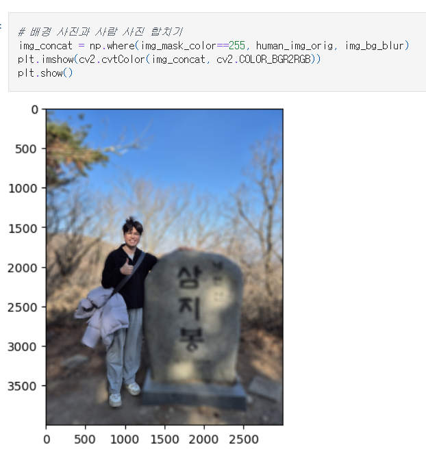
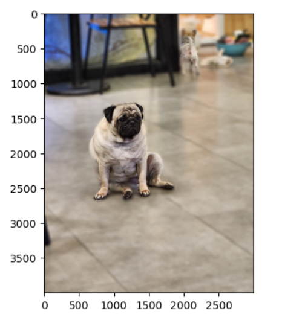
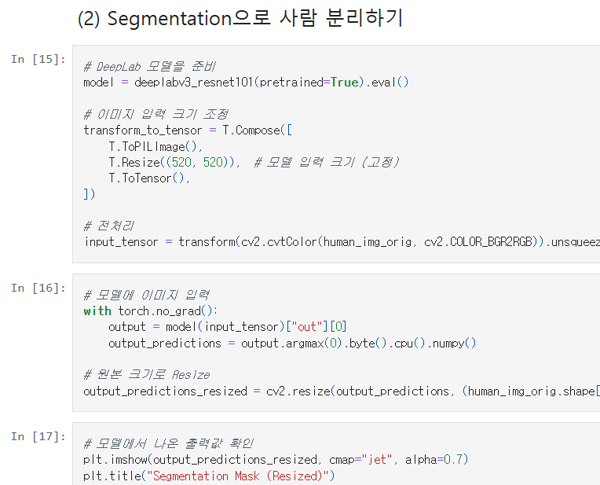
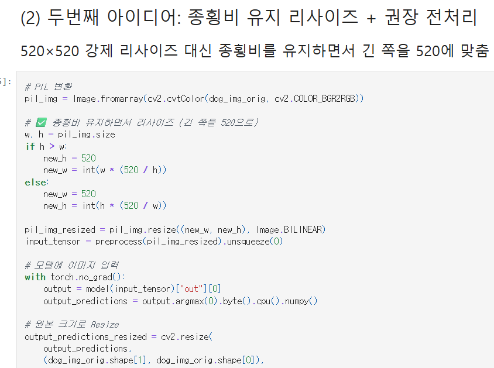
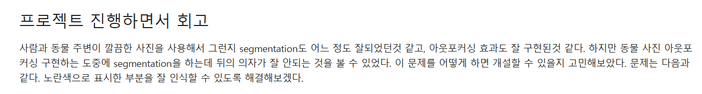
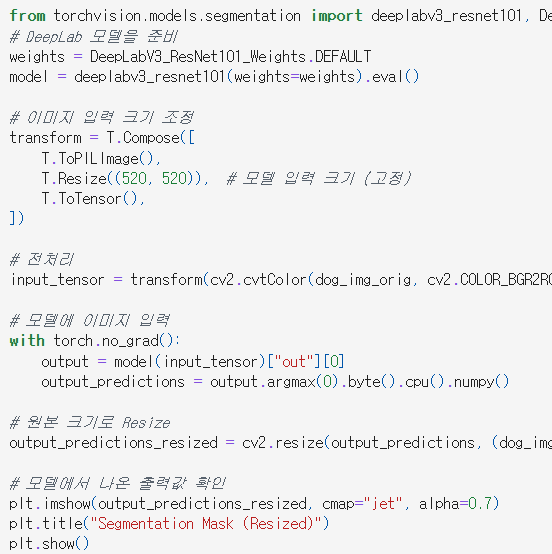

# AIFFEL Campus Online Code Peer Review Templete
- 코더 : 정주열
- 리뷰어 : 최수정


# PRT(Peer Review Template)
- [x]  **1. 주어진 문제를 해결하는 완성된 코드가 제출되었나요?**
    - 문제에서 요구하는 최종 결과물이 첨부되었는지 확인
        - 중요! 해당 조건을 만족하는 부분을 캡쳐해 근거로 첨부
        네, 아래와 같이 3가지 결과물 모두 확인했습니다.
        
        
        
    
- [x]  **2. 전체 코드에서 가장 핵심적이거나 가장 복잡하고 이해하기 어려운 부분에 작성된 
주석 또는 doc string을 보고 해당 코드가 잘 이해되었나요?**
    - 해당 코드 블럭을 왜 핵심적이라고 생각하는지 확인
    - 해당 코드 블럭에 doc string/annotation이 달려 있는지 확인
    - 해당 코드의 기능, 존재 이유, 작동 원리 등을 기술했는지 확인
    - 주석을 보고 코드 이해가 잘 되었는지 확인
        - 중요! 잘 작성되었다고 생각되는 부분을 캡쳐해 근거로 첨부
        네, 각 과정마다 md로 (1), (2) .. 이런식으로 잘 적어주셨습니다.
        또한, 코드마다 주석을 잘 달아주셨습니다.
        
        
- [x]  **3. 에러가 난 부분을 디버깅하여 문제를 해결한 기록을 남겼거나
새로운 시도 또는 추가 실험을 수행해봤나요?**
    - 문제 원인 및 해결 과정을 잘 기록하였는지 확인
    - 프로젝트 평가 기준에 더해 추가적으로 수행한 나만의 시도, 
    실험이 기록되어 있는지 확인
        - 중요! 잘 작성되었다고 생각되는 부분을 캡쳐해 근거로 첨부
            네, 최신 가중치, 정규화, 종횡비 조정이라는 새로운 시도들을 수행하셨고 아래 사진은 3번째 아이디어로 종횡비 조정하신 부분입니다.
            
- [x]  **4. 회고를 잘 작성했나요?**
    - 주어진 문제를 해결하는 완성된 코드 내지 프로젝트 결과물에 대해
    배운점과 아쉬운점, 느낀점 등이 기록되어 있는지 확인
    - 전체 코드 실행 플로우를 그래프로 그려서 이해를 돕고 있는지 확인
        - 중요! 잘 작성되었다고 생각되는 부분을 캡쳐해 근거로 첨부
        그래프는 없었지만, 회고 작성해주셨습니다!
            
- [x]  **5. 코드가 간결하고 효율적인가요?**
    - 파이썬 스타일 가이드 (PEP8) 를 준수하였는지 확인
    - 코드 중복을 최소화하고 범용적으로 사용할 수 있도록 함수화/모듈화했는지 확인
        - 중요! 잘 작성되었다고 생각되는 부분을 캡쳐해 근거로 첨부
            각 코드마다 주석을 달아서 복잡하지 않게 코드를 작성하셨습니다
            

# 회고(참고 링크 및 코드 개선)
```
# 리뷰어의 회고를 작성합니다.
# 코드 리뷰 시 참고한 링크가 있다면 링크와 간략한 설명을 첨부합니다.
# 코드 리뷰를 통해 개선한 코드가 있다면 코드와 간략한 설명을 첨부합니다.
저는 문제점에서 원인을 해결하기 위해 여러 기술들을 알아보았지만 코드가 복잡해져서인지, lms환경이 아예 다운되는 문제가 생겨서 코드 실행을 못해봤었는데.
주열님은 간단하게 더 발전시킬 수 있는 항목들을 찾아 적용하신 부분들, 특히나 종횡비 조정같은 부분들이 인상 깊었습니다.
- 참고 링크는 PyTorch에서 제공하는 Deeplabv3모델의 최신 가중치에 관한 문서입니다.
    [DeepLabV3_ResNet101_Weights](https://docs.pytorch.org/vision/0.26/models/generated/torchvision.models.segmentation.deeplabv3_resnet101.html#:~:text=deeplabv3_resnet101.%20torchvision.models.segmentation.deeplabv3_resnet101(*%2C%20weights:%20Optional%5BDeepLabV3_ResNet101_Weights%5D%20=%20None%2C%20progress:%20bool%20=%20True%2C)
```
